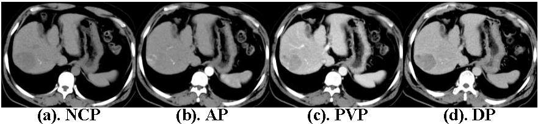
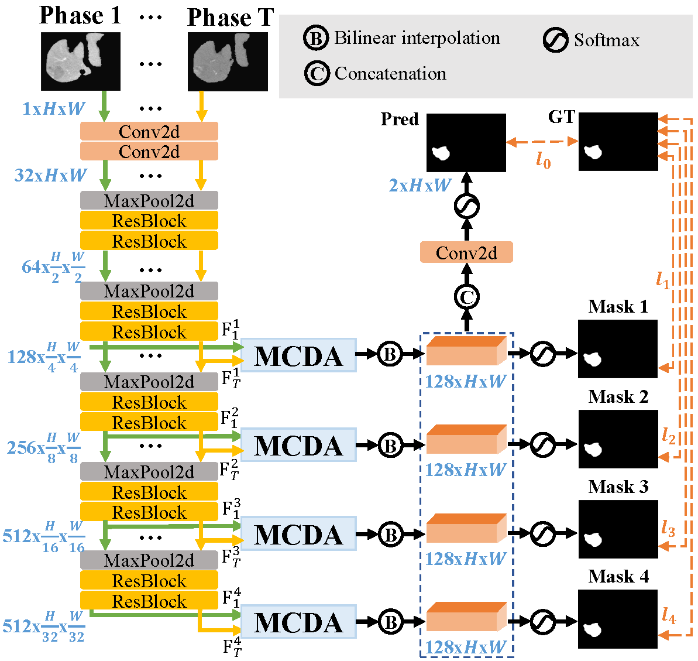
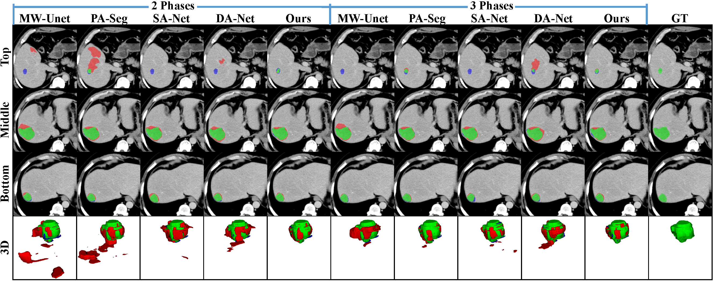

# Adaptive Multi-Phase Liver Tumor Segmentation with Multi-Scale Supervision

## Paper

This repository contains available information on papers submitted to IEEE Signal Processing Letters::

**Adaptive Multi-Phase Liver Tumor Segmentation with Multi-Scale Supervision**

## Motivation

Current multi-phase liver tumor segmentation (MP-LiTS) methods enhance features in individual phases through auxiliary phases, overlooking the potential contribution of complementary information across various phases, which can lead to performance limitations. And the absence of constraints on feature representation across scales may result in over-segmentation.

An example of CT images with different phases. (a) Non-Contrast Phase, (b) Arterial Phase, (c) Portal Venous Phase, (d) Delayed Phase.

## Framework

This framework comprises the Multi-phase Channel-stacked Dual Attention (MCDA) module and Scale-weighted Loss (SWL) function. The insertable MCDA module can receive input from an arbitrary number of phases. It dynamically assigns weights to each phase through phase fusion operations, enabling comprehensive exploration of the interrelationships among different phases at varying scales.

## Visualization of Segmentation Results

Visualization results. Green regions represent correct segmentation, red regions are false positive results, and blue regions indicate false negatives.

